# 🧸 LoveLedger

<p align="center">
    
</p>
**"금융 내역 기반 그림 일기 가계부 모바일 서비스"**

[📘 API 명세서](https://fanatical-fisher-639.notion.site/API-1ac855ca54ea81ddae09d562ed06097a?source=copy_link) · [🎨 발표 자료](https://www.canva.com/design/DAGkGKLY1Lc/nmwvDEQ9ydIVKm0wXxBByA/view?utm_content=DAGkGKLY1Lc&utm_campaign=designshare&utm_medium=link2&utm_source=uniquelinks&utlId=h24903cf5b5#7) · [🧸 콘텐츠 기획서](https://www.canva.com/design/DAGguU9ryks/zIQbMzNfOiDiXiDAf9D88g/edit)

---

# 🙂 기여한 부분

## 담당 역할

1. 일기 API 개발
2. Gemini 연동 및 프롬프트 엔지니어링
3. Docker 기반 CI/CD 구축, 인프라 환경 설정
4. 마이페이지 구현, API 연동(FE)

## 🚀 트러블 슈팅

### 1. 배포 시 발생하는 서버 중단 시간

#### 문제 상황

- 프로젝트는 신규 기능 배포 및 버그 수정 과정에서 서비스 중단 없이 안정적으로 배포하는 것이 중요한 과제라고 생각했다.
- 기존 방식은 배포 중 서버 재시작, 환경 설정 갱신 등의 이유로 짧게나마 서버 중단 시간이 발생해 사용자 경험에 영향을 줄 수 있었다. (약 30초 가량의 중단 시간 발생)

#### 해결 방법 : `블루-그린 무중단 배포 적용`

- 기존(Blue) 환경과 새 버전(Green) 환경을 병렬로 구성하여, 새 버전을 Green 환경에 미리 배포하고 충분히 테스트한 후 트래픽 스위칭만으로 전환하였다.
- 전환 과정에서 서버를 중단하거나 재시작할 필요가 없기 때문에, 사용자에게는 무중단으로 서비스가 제공될 수 있었다.
- 헬스체크를 통해, 문제가 발견되면 빠르게 Blue 환경으로 롤백할 수 있어 배포 리스크도 최소화했다.
- 10초 가량의 중단시간을 `1초 미만`으로 줄이는데 성공할 수 있었다.

---

### 2. 잘못된 방화벽 관리로 인한 해킹

```jsx
mysql> select * from README;

| id |Message| Bitcoin_Address |
|  1 | I have backed up all your databases. To recover them you must pay 0.009 BTC (Bitcoin) to this address:. Backup List: qp. After your payment email me at []() with your server IP and transaction ID and you will get a download link to your backup. Emails without transaction ID and server IP will be ignored.  |  |

```

#### 문제 상황

- AWS ec2에 Docker 컨테이너로 띄운 `MySQL에 해커가 침투하여, DB 내용이 모두 삭제되는 문제`가 발생
  - 이를 복구하려면 해커에게 0.009 비트코인을 요구받음
- EC2에 `UFW 방화벽`을 설정해 외부 접근을 차단했다고 생각했지만, **Docker는 자체 네트워크를 사용하기 때문에 UFW와 무관하게 외부에서 직접 접근 가능**했던것이 원인이었다.
- 개발 환경에서 MySQL을 Docker로 띄우며 **모든 IP(0.0.0.0)** 에 대해 포트를 오픈한 상태로 실행했었다.

#### 해결 방법

- 사고 후 Docker의 네트워크 및 포트 바인딩 방식을 다시 학습했다.
- 모든 IP에 대해 열려 있던 포트 바인딩(0.0.0.0)을 내부 네트워크로만 접근 가능하도록 변경
- UFW 방화벽만으로는 Docker 보안을 충분히 막을 수 없다는 것을 깨닫게 됨
- 이 사건을 계기로 배포 및 개발 환경에서의 보안의 중요성을 느끼게 되었다.

---

### 3. 소설 및 그림 퀄리티

#### 문제 상황

- 금융내역을 기반으로 소설을 생성할때, 출력물의 스토리라인, 문장 흐름, 감정 표현 등이 단조롭고 품질이 낮다는 문제를 발견했다.
- 사용자의 흥미를 유도하기 위해서는 동적인 소설과 그림 생성이 필요하다고 생각했다.

#### 해결방안 : 프롬프트 엔지니어링

- 프롬프트 엔지니어링을 통해 소설과 그림의 품질을 높였다.
- **페르소나(Persona) 기법**으로 AI에게 명확한 화자·성격·배경 정보를 부여해 일관성 있는 서술을 유도
- **Few-shot 기법**으로 예시를 함께 제공해 AI가 문체와 내용 구조를 학습하도록 설계함
- 과거 사용자가 작성한 소설의 다음편을 작성하도록 프롬프트를 구성해서 소설 생성의 일관성을 높였다.

---

## 🧸 프로젝트 개요

#### 프로젝트 이름: LoveLedger

#### 진행 기간: 2025.02.24 ~ 2025.04.13

#### 서비스 소개:

LoveLedger는 사용자의 귀찮은 금융 관리와 가계부 작성을 자동화하고 금융 내역을 기반으로 한 그림 소설을 제공해 금융 관리에 재미를 더해줍니다.

---

## ✨ 주요 기능 및 서비스 화면

#### 1. 사용자 계정 관리

- Google 소셜 로그인
- 사용자 계좌 등록
- 부부 계좌 연동

<p align="center">
    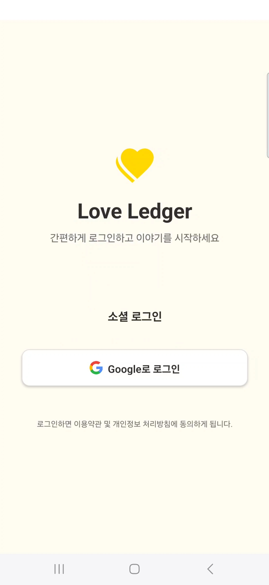
    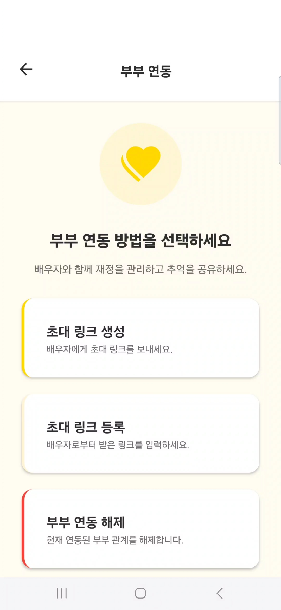
    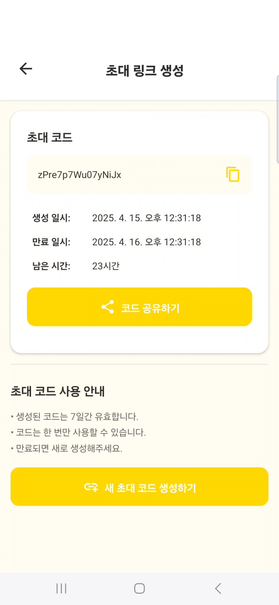
</p>

#### 2. 가계부 기능

- **금융 내역 불러오기**: SSAFY 금융 API 연동하여 실시간 금융 내역 조회
- **금융 내역 카테고리화**: KoBert 기반 카테고리 분류 모델로 소비 유형 분류
- **통계 및 시각화**: 주간, 월간에 따른 소비 패턴 및 지출 내역 요약

<p align="center">
    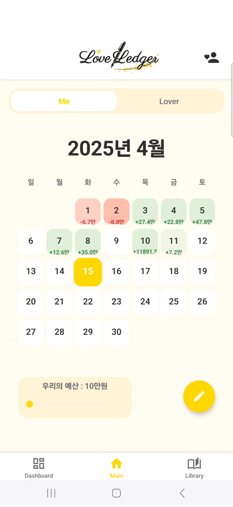
    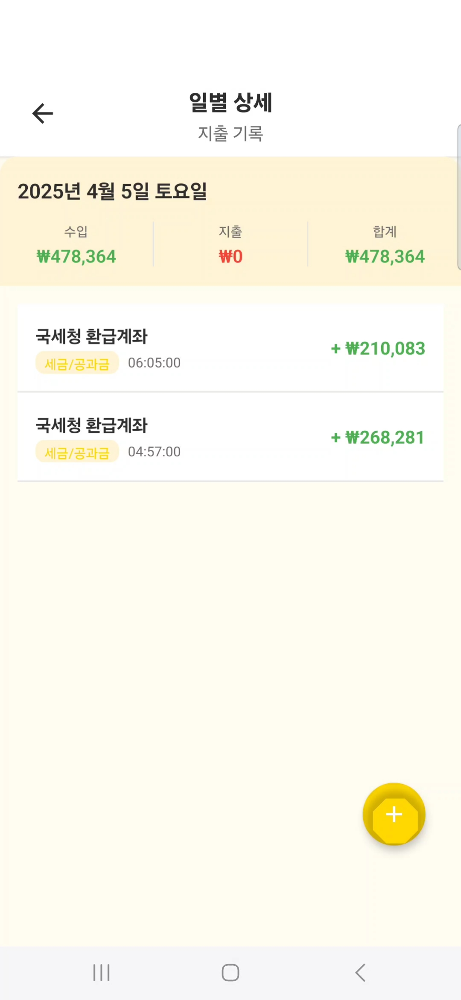
    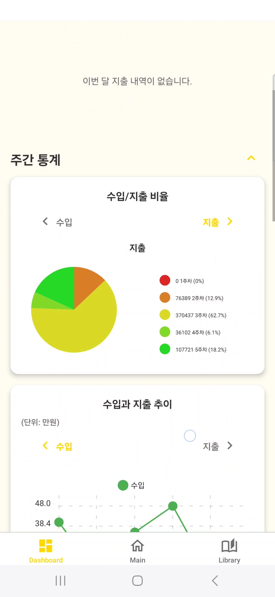
</p>

#### 3. 금융 내역 기반 그림 소설

- 스토리 생성 설정(뉴스, 파파라치, 판타지, 러브코미디, 유행어 5가지 스타일 선택)
- 금융 내역 기반 스토리 생성 (프롬프트 엔지니어링 적용)
- 스토리 기반 그림 생성 및 저장 (6가지 스타일에 따른 표지 생성)
- 소설 라이브러리

<p align="center">
    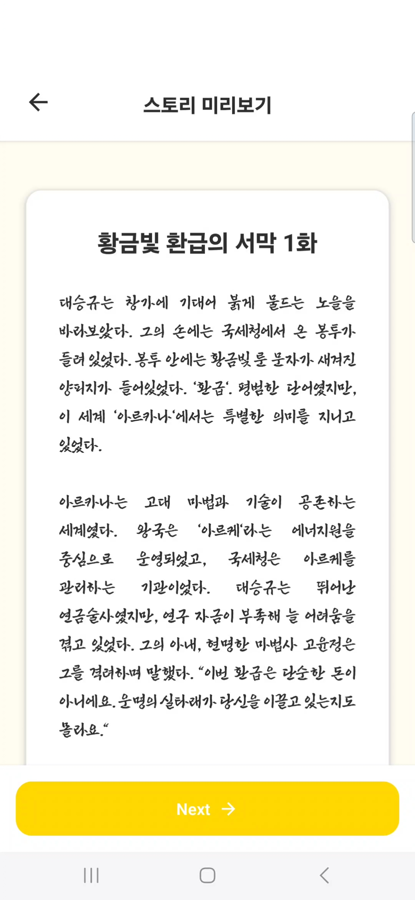
    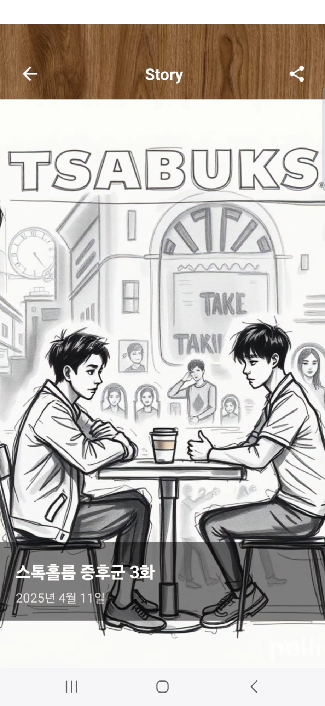
    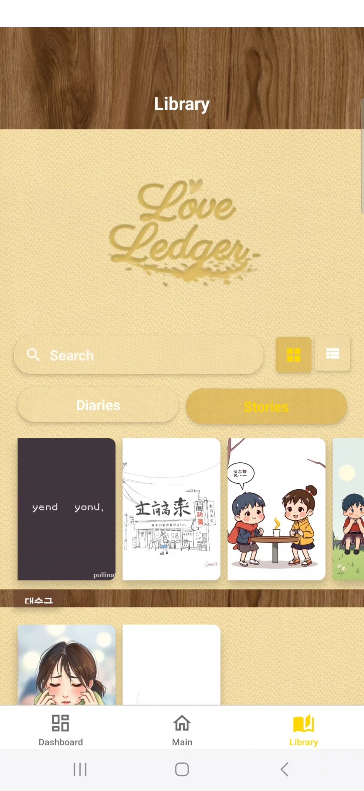

</p>

## 🧪 카테고리 분류 모델 학습 결과 (KoBERT)

한국 전화번호부 데이터를 활용하여 금융 내역을 19개의 카테고리로 분류하는 모델을 학습

<p align="center">
    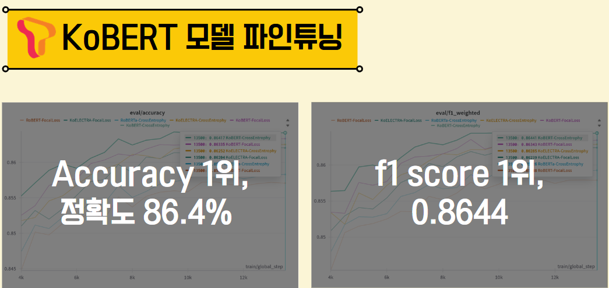
</p>

## 🔍 기술 스택 및 구조

| 구성      | 기술                                         |
| --------- | -------------------------------------------- |
| Frontend  | React Native, TypeScript, expo , React-Query |
| Backend   | Spring Boot, JPA, Redis, MySQL               |
| AI Server | FastAPI, PyTorch, KoBERT                     |
| Infra     | Docker, GitLab CI/CD, AWS S3                 |
| 기타      | Jenkins                                      |

<p align="center">
    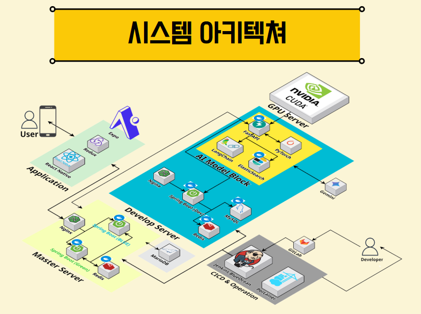
</p>

## 📄 문서 및 참고 링크

- [API 명세서](https://fanatical-fisher-639.notion.site/API-1ac855ca54ea81ddae09d562ed06097a?source=copy_link)

- [ERD](https://fanatical-fisher-639.notion.site/ERD-1ac855ca54ea8177b413fd46fb8f968a?source=copy_link)

- [요구사항 정의서 & 기능 명세서](https://docs.google.com/spreadsheets/d/1mhXzsyjTDqlWeEmA6ppZ3pnGrrh1Iglm8hz90-1pSfc/edit?usp=sharing)

- [개발 환경 가이드](https://fanatical-fisher-639.notion.site/1ac855ca54ea819c83ddcd1ca0e251bf?source=copy_link)

- [플로우 차트](https://fanatical-fisher-639.notion.site/1ac855ca54ea8096a515c6c593e6b4c8?source=copy_link)

## 🧑‍💻 팀원 소개

|       역할       | 이름                              |
| :--------------: | :-------------------------------- |
|   **Frontend**   | 강성운 · 신경원                   |
| **Backend & AI** | 김성민 · 백승민 · 상승규 · 편민준 |
|    **Infra**     | 김성민 · 상승규                   |
